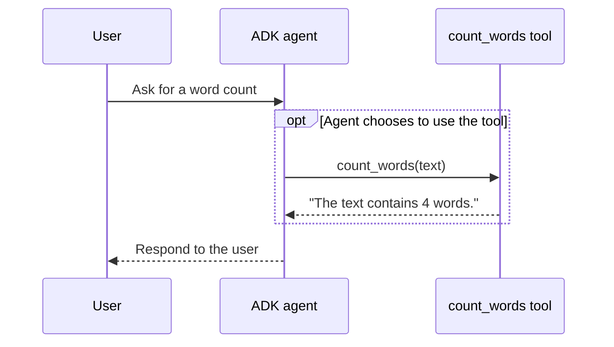

# How an ADK agent uses a custom tool

This small example accompanies a three-minute developer education video. It
shows how a plain Python function is described and made available to a Google
Agent Development Kit (ADK) agent.

## What to notice

Open [`word_count_agent/agent.py`](word_count_agent/agent.py):

1. `count_words(text)` performs one deterministic task.
2. Its docstring describes the task and the `text` argument. ADK uses the
   function's signature and docstring to describe the tool to the model.
3. `tools=[count_words]` makes the function available to `root_agent`.

The agent may then choose to call the tool for an appropriate user request.
Adding a tool does not guarantee that the model will call it on every turn.

**Example request:** “How many words are in: The quick brown fox?”

**Function result if called with that text:** “The text contains 4 words.”

The example result illustrates the function's behavior; it is not a captured
ADK agent run. The video can be recorded as a code walkthrough without
installing ADK or connecting to a model. Running the full agent is a separate,
optional production decision.

## Request flow

## Source and scope

This is an original, simplified example based on Google's documentation for
custom function tools. It illustrates the function/tool relationship; it does
not include model credentials, evaluation, deployment, or a migration workflow.

- [Google ADK: custom function tools](https://google.github.io/adk-docs/tools-custom/function-tools/)
- [Google Agents CLI: add a custom tool](https://google.github.io/agents-cli/guide/hands-on-tutorial/)
